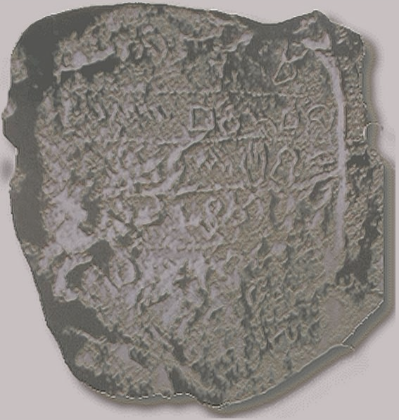
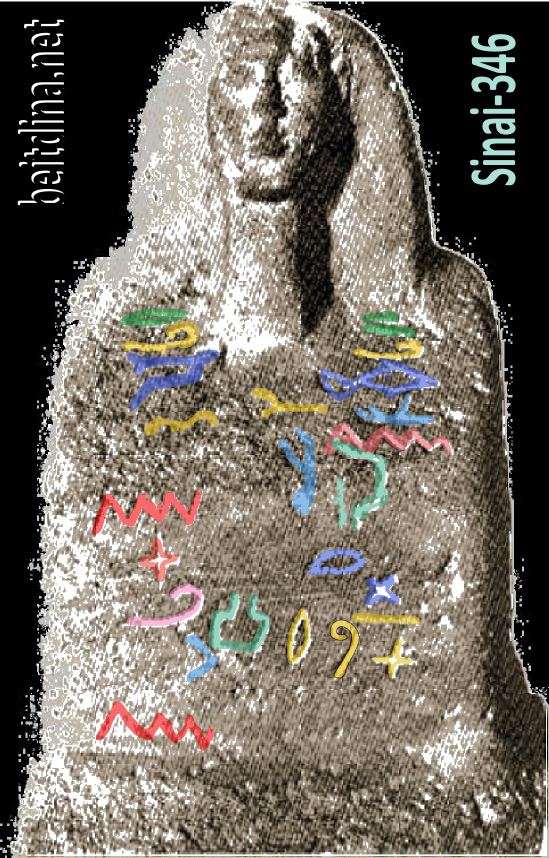
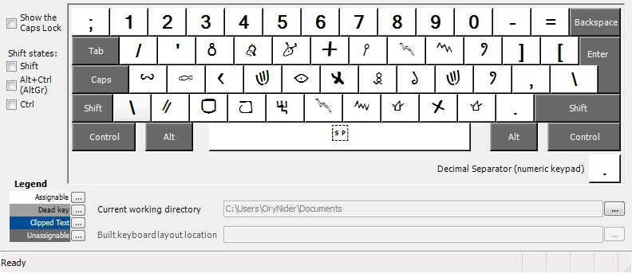
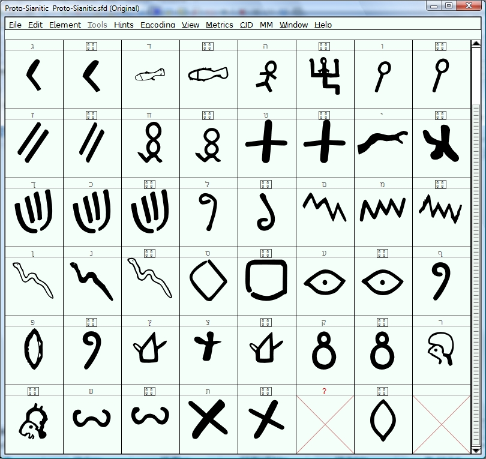

# Proto-Sianitic

# Proto-Sianitic Font Version 0.3 Alpha
  
# This font contain glyphs of ideograms and pictograms for realizing the ancient sianitic and cananite alphabets for the comparation tables.

Stones:

Samples:

The fonts are encoded acording to unicode.org font subset maps.
   
1. [To Install the Font on Computer]     
2. [Install Font on Browser]   [Install Font on Computer](#install-font-on-computer) 
    
## Install Font on Computer    For Mac: Open the TTF file using Font Book, and click “install”
      
For Windows: Right-click on the TTF file and select install 
  
## Getting Involved  Send suggestions for changes to the *Proto-Sianitic* project by submitting a [new issue](https://github.com/beitdina/Proto-Sianitic/issues/new).
